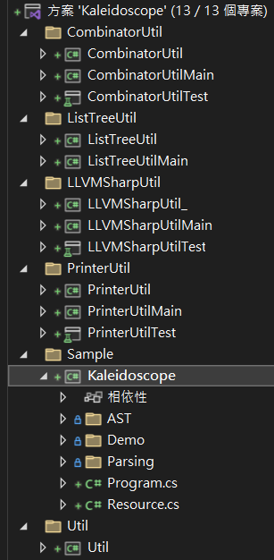

# kaleidoscope_llvmsharp_parsercombinater

> [!NOTE]
> This would be a little bit wasteful if I kept the repository private
> 
> This is a backup of when I learning [LLVMSharp](https://github.com/dotnet/LLVMSharp) and use parser combinator to make a programming language

Kaleidoscope, is a programming language described in [LLVM tutorial](https://llvm.org/docs/tutorial/MyFirstLanguageFrontend/index.html)

## Requirement
  
- [.NET 7.0](https://dotnet.microsoft.com/en-us/download/dotnet/7.0)
  
- [Visual Studio 2022 Preview](https://visualstudio.microsoft.com/zh-hant/vs/preview/)

Run `Sample/Kaleidoscope` project



## Expected Input Output:

- [Code](#code)

- [LLVM IR running output](#llvm-ir-running-output)

- [LLVM IR](#llvm-ir)

- [AST](#ast)

- [Pre LLVM structure](#pre-llvm-structure)


## Code

```cpp
extern putchar(int32 x): int32

def printdensity(double d): void {
    if d > 8.0 {
        call putchar(32); // ' '
        return;
    }
    if d > 4.0 {
        call putchar(46); // '.'
        return;
    }
    if d > 2.0 {
        call putchar(43); // '+'
    } else {
        call putchar(42); // '*'
    }
    return;
}

def mandelconverger(
    double real, 
    double imag,
    double iters, 
    double creal,
    double cimag
): double {
    if iters > 255.0 {
        return iters;
    }
    if real * real + imag * imag > 4.0 {
        return iters;
    }
    return mandelconverger(
        real * real - imag * imag + creal,
        2.0 * real * imag + cimag,
        iters + 1.0, creal, cimag
    );
}

def mandelconverge(double real, double imag): double {
    return mandelconverger(real, imag, 0.0, real, imag);
}

def mandelhelp(
    double xmin, 
    double xmax, 
    double xstep, 
    double ymin, 
    double ymax, 
    double ystep
): void {
    var y: double = ymin;
    while y < ymax {
        var x: double = xmin;
        while x < xmax {
            call printdensity(mandelconverge(x, y)));
            x = x + xstep;
        }
        call putchar(10);
        y = y + ystep;
    }
    return;
}

def mandel(
    double realstart,
    double imagstart,
    double realmag,
    double imagmag
): void {
    call mandelhelp(
        realstart, 
        realstart + realmag * 78.0, 
        realmag,
        imagstart, 
        imagstart + imagmag * 40.0, 
        imagmag
    );
    return;
}

main {
    call mandel(-2.3, -1.3, 0.05, 0.07);
    call putchar(10);

    call mandel(0.1, -1.0, 0.03, 0.05);
    call putchar(10);

    call mandel(-0.9, -1.4, 0.02, 0.03);
    call putchar(10);

    call mandel(-0.0, -0.0, 0.02, 0.03);
    call putchar(10);

    return 0;
}
```


## LLVM IR running output

```
***********************++++..++++++++++++++***********************************
***********************+++++..++++++++++++..+*********************************
************************+.+++++++++++++++++..+********************************
************************+.+++++++++++++++++...++******************************
*************************+.++++++++++++++++.. .++*****************************
**************************+++++++++++++++.... .+++****************************
***************************++++++++++++...... ..++++**************************
****************************++++++++++..    .  .+++++*************************
*****************************++++++++....       .+++++************************
*****************************++++++++..          .++++++**********************
******************************+++++++..           ..++++++********************
*******************************++++++..             .++++++*******************
*******************************++++++..              ..+++++++****************
********************************+++++..                 ..++++++**************
********************************+++++..                   .....++++***********
********************************+++++..                      ..   ..+++*******
*********************************++++..                            ...++++++++
*********************************++++..                              ...++++++
*********************************++++...                                  ....
*********************************++++...                                  ....
*********************************++++..                               ..++++++
*********************************++++..                            ...++++++++
********************************+++++..                       .    .+++*******
********************************+++++..                   ......++++**********
********************************+++++..                 ..+++++++*************
*******************************++++++..               ..++++++****************
*******************************++++++..             .+++++++******************
******************************+++++++.             .++++++********************
*****************************++++++++.           .++++++**********************
*****************************++++++++....       .+++++************************
****************************++++++++++..        .++++*************************
***************************++++++++++++...... ..++++**************************
**************************+++++++++++++++.... .++++***************************
*************************+.++++++++++++++++.. .++*****************************
*************************.+++++++++++++++++...++******************************
************************+.+++++++++++++++++..++*******************************
***********************+++++..++++++++++++..+*********************************
***********************++++..++++++++++++++***********************************
***********************+++..++************************************************
************************+++***************************************************

++****************************************************************************
++++**************************************************************************
+++++*************************************************************************
+++++++***********************************************************************
.+++++++**********************************************************************
.+++++++++********************************************************************
 ..+++++++++******************************************************************
  ..+++++++++*****************************************************************
    ..++++++++++**************************************************************
     ...++++++++++************************************************************
       ...++++++++++**********************************************************
         ...+++++++++++*******************************************************
            ....++++++++++****************************************************
               .....+++++++++*************************************************
                  .........++++++*********************************************
                      ...     ..++++++****************************************
                                ...+++++++++**********************************
                                 ....+++++++++++++++++++**********************
                                    ....+++++++++++++++++++++*****************
                                          ...........++++++++++***************
                                                                **************
                                          ...........++++++++++***************
                                    ....+++++++++++++++++++++*****************
                                 ....+++++++++++++++++++**********************
                                ...+++++++++**********************************
                      ...     ..++++++****************************************
                  .........++++++*********************************************
               .....+++++++++*************************************************
            ....++++++++++****************************************************
         ...+++++++++++*******************************************************
       ...++++++++++**********************************************************
     ...++++++++++************************************************************
    ..++++++++++**************************************************************
  ..+++++++++*****************************************************************
 ..+++++++++******************************************************************
.+++++++++********************************************************************
.+++++++**********************************************************************
+++++++***********************************************************************
+++++*************************************************************************
++++**************************************************************************

+*****************************************************************************
++++**************************************************************************
+++++++*****************+++++++***********************************************
..+++++++++*******+++++++++++++++++*******************************************
...+++++++++++++++++++++++++++++++++++****************************************
....++++++++++++++++++++++++++++++++.+++**************************************
....+++++++++++++++++++++++++++++++....+++************************************
+++.++++++++++++++++++++++++++++++++....++++**********************************
++++++++++++++++++++++++++++++++++++.....++++*********************************
++++++++++++++++++++++++++++++++++++......+++++*******************************
++++++++++++++++++++++++++++++++++++.......+++++******************************
++++++++++++++++++++++++++++++++++++... .....+++++****************************
++++++++++++++++++++++++++++++++++++....   . .+++++***************************
++++++++++++++++++++++++++++++++++++.....  . .++++++**************************
+++++++++++++++++++++++++++++++++++......  ....+++++++************************
+++++++++++++++++++++++++++++++++........  .....+++++++***********************
++++++++++++++++++++++++++++++...........   ....++++++++**********************
+++++++++++++++++++++++++++...............   ....+++++++++********************
+++++++++++++++++++++++++........ ........    ...++++++++++*******************
++++++++++++++++++++++++......      ......     ...++++++++++******************
+++++++++++++++++++++++......                   ...+++++++++++****************
+++++++++++++++++++++++........                  ..++++++++++++***************
*+++++++++++++++++++++.........                   ..+++++++++++++*************
*+++++++++++++++++++++....  ..                    ...+++++++++++++************
**++++++++++++++++++++....  .                       ...+++++++++++++**********
***+++++++++++++++++++...                            ...++++++++++++++********
****++++++++++++++++++....                            ...+++++++++++++++******
*****+++++++++++++++++...                               ...+++++++++++++++****
*****+++++++++++++++++...                                ...++++++++++++++++**
******++++++++++++++++....                                 ...++++++++++++++++
*******+++++++++++++++....                                  ....++++++++++++++
*******+++++++++++++++....                                    .....+++++++++++
********++++++++++++++.....                                     .....+++++++++
********+++++++++++++++....                                        .....++++++
*********++++++++++++++....                                          ......+++
*********++++++++++++++....                                             ......
*********++++++++++++++...                                                ....
**********+++++++++++++...                                                   .
**********+++++++++++++...
**********+++++++++++++....


                                                                     .........
                                                                    .........+
                                                           ........+++++++++++
                                                         ......+++++++++++++++
                                                      .......+++++++++++++++++
                                                    .......+++++++++++++++++++
                                                    .....++++++++++++*********
                                       ..          ...+++++++++***************
                                  ............... .+++++++********************
                               ...............++++++++************************
                            ...........++++++++++++***************************
                          .......+++++++++++++++******************************
                       ......++++++++++++++++*********************************
                     .....++++++++++++++++************************************
                   ....++++++++++++++++***************************************
                 ....++++++++++++++++*****************************************
               ....+++++++++++++++********************************************
             ....+++++++++++++++**********************************************
            ...+++++++++++++++************************************************
          ...+++++++++++++++**************************************************
         ...++++++++++++++****************************************************
       ...++++++++++++++******************************************************
      ...++++++++++++++*******************************************************
     ...+++++++++++++*********************************************************
     ..++++++++++++***********************************************************
    ..++++++++++++************************************************************
   ..+++++++++++**************************************************************
  ...++++++++++***************************************************************
....++++++++++****************************************************************
...+++++++++******************************************************************
...++++++++*******************************************************************
..++++++++********************************************************************
..++++++**********************************************************************
.++++++***********************************************************************
++++++************************************************************************
++++**************************************************************************
+++***************************************************************************
+*****************************************************************************
******************************************************************************
```

## LLVM IR

```ll
LLVM IR:
; ModuleID = 'file'
source_filename = "file"

declare i32 @putchar(i32)

define void @printdensity(double %0) {
entry:
  %real_ordered_greater_than_temp = fcmp ogt double %0, 8.000000e+00
  br i1 %real_ordered_greater_than_temp, label %then, label %after_then

then:                                             ; preds = %entry
  %call_temp = call i32 @putchar(i32 32)
  ret void

after_then:                                       ; preds = %entry
  %real_ordered_greater_than_temp4 = fcmp ogt double %0, 4.000000e+00
  br i1 %real_ordered_greater_than_temp4, label %then1, label %after_then2

then1:                                            ; preds = %after_then
  %call_temp5 = call i32 @putchar(i32 46)
  ret void

after_then2:                                      ; preds = %after_then
  %real_ordered_greater_than_temp6 = fcmp ogt double %0, 2.000000e+00
  br i1 %real_ordered_greater_than_temp6, label %then3, label %else

then3:                                            ; preds = %after_then2
  %call_temp7 = call i32 @putchar(i32 43)
  br label %after_then_else

else:                                             ; preds = %after_then2
  %call_temp8 = call i32 @putchar(i32 42)
  br label %after_then_else

after_then_else:                                  ; preds = %else, %then3
  ret void
}

define double @mandelconverger(double %0, double %1, double %2, double %3, double %4) {
entry:
  %real_ordered_greater_than_temp = fcmp ogt double %2, 2.550000e+02
  br i1 %real_ordered_greater_than_temp, label %then, label %after_then

then:                                             ; preds = %entry
  ret double %2

after_then:                                       ; preds = %entry
  %fmul_temp = fmul double %0, %0
  %fmul_temp3 = fmul double %1, %1
  %fadd_temp = fadd double %fmul_temp, %fmul_temp3
  %real_ordered_greater_than_temp4 = fcmp ogt double %fadd_temp, 4.000000e+00
  br i1 %real_ordered_greater_than_temp4, label %then1, label %after_then2

then1:                                            ; preds = %after_then
  ret double %2

after_then2:                                      ; preds = %after_then
  %fmul_temp5 = fmul double %0, %0
  %fmul_temp6 = fmul double %1, %1
  %fadd_temp7 = fadd double %fmul_temp6, %3
  %fsub_temp = fsub double %fmul_temp5, %fadd_temp7
  %fmul_temp8 = fmul double 2.000000e+00, %0
  %fmul_temp9 = fmul double %fmul_temp8, %1
  %fadd_temp10 = fadd double %fmul_temp9, %4
  %fadd_temp11 = fadd double %2, 1.000000e+00
  %call_temp = call double @mandelconverger(double %fsub_temp, double %fadd_temp10, double %fadd_temp11, double %3, double %4)
  ret double %call_temp
}

define double @mandelconverge(double %0, double %1) {
entry:
  %call_temp = call double @mandelconverger(double %0, double %1, double 0.000000e+00, double %0, double %1)
  ret double %call_temp
}

define void @mandelhelp(double %0, double %1, double %2, double %3, double %4, double %5) {
entry:
  %y = alloca double, align 8
  store double %3, ptr %y, align 8
  br label %while_condition_check

while_condition_check:                            ; preds = %after_while, %entry
  %y4 = load double, ptr %y, align 8
  %real_ordered_less_than_temp = fcmp olt double %y4, %4
  br i1 %real_ordered_less_than_temp, label %while_body, label %after_while3

while_body:                                       ; preds = %while_condition_check
  %x = alloca double, align 8
  store double %0, ptr %x, align 8
  br label %while_condition_check1

while_condition_check1:                           ; preds = %while_body2, %while_body
  %x5 = load double, ptr %x, align 8
  %real_ordered_less_than_temp6 = fcmp olt double %x5, %1
  br i1 %real_ordered_less_than_temp6, label %while_body2, label %after_while

while_body2:                                      ; preds = %while_condition_check1
  %x7 = load double, ptr %x, align 8
  %y8 = load double, ptr %y, align 8
  %call_temp = call double @mandelconverge(double %x7, double %y8)
  call void @printdensity(double %call_temp)
  %x9 = load double, ptr %x, align 8
  %fadd_temp = fadd double %x9, %2
  store double %fadd_temp, ptr %x, align 8
  br label %while_condition_check1

after_while:                                      ; preds = %while_condition_check1
  %call_temp10 = call i32 @putchar(i32 10)
  %y11 = load double, ptr %y, align 8
  %fadd_temp12 = fadd double %y11, %5
  store double %fadd_temp12, ptr %y, align 8
  br label %while_condition_check

after_while3:                                     ; preds = %while_condition_check
  ret void
}

define void @mandel(double %0, double %1, double %2, double %3) {
entry:
  %fmul_temp = fmul double %2, 7.800000e+01
  %fadd_temp = fadd double %0, %fmul_temp
  %fmul_temp1 = fmul double %3, 4.000000e+01
  %fadd_temp2 = fadd double %1, %fmul_temp1
  call void @mandelhelp(double %0, double %fadd_temp, double %2, double %1, double %fadd_temp2, double %3)
  ret void
}

define i32 @main() {
entry:
  call void @mandel(double 0xC002666660000000, double 0xBFF4CCCCC0000000, double 0x3FA99999A0000000, double 0x3FB1EB8520000000)
  %call_temp = call i32 @putchar(i32 10)
  call void @mandel(double 0x3FB99999A0000000, double -1.000000e+00, double 0x3F9EB851E0000000, double 0x3FA99999A0000000)
  %call_temp1 = call i32 @putchar(i32 10)
  call void @mandel(double 0xBFECCCCCC0000000, double 0xBFF6666660000000, double 0x3F947AE140000000, double 0x3F9EB851E0000000)
  %call_temp2 = call i32 @putchar(i32 10)
  call void @mandel(double -0.000000e+00, double -0.000000e+00, double 0x3F947AE140000000, double 0x3F9EB851E0000000)
  %call_temp3 = call i32 @putchar(i32 10)
  ret i32 0
}
```

## AST

```
AST:
Extern {
    prototype:
        Prototype {
            name: putchar
            args: x
            argTys: int32
            isVarArgs: 0
            return: int32
        }
}
FuncDef {
    prototype:
        Prototype {
            name: printdensity
            args: d
            argTys: double
            isVarArgs: 0
            return: void
        }
    statements:
        IfStatementAST {
            condExpr:
                GreaterThanExprAST {
                    LHS:
                        FuncVarAST { d }
                    RHS:
                        ConstFloat { 8 }
                }
            thenStatements:
                CallFuncStatementAST {
                    FunctionCallee {
                        name: putchar
                        args:
                            ConstInt { 32 }
                    }
                }
                ReturnStatementAST {
                }
        }
        IfStatementAST {
            condExpr:
                GreaterThanExprAST {
                    LHS:
                        FuncVarAST { d }
                    RHS:
                        ConstFloat { 4 }
                }
            thenStatements:
                CallFuncStatementAST {
                    FunctionCallee {
                        name: putchar
                        args:
                            ConstInt { 46 }
                    }
                }
                ReturnStatementAST {
                }
        }
        IfStatementAST {
            condExpr:
                GreaterThanExprAST {
                    LHS:
                        FuncVarAST { d }
                    RHS:
                        ConstFloat { 2 }
                }
            thenStatements:
                CallFuncStatementAST {
                    FunctionCallee {
                        name: putchar
                        args:
                            ConstInt { 43 }
                    }
                }
            elseStatementAST:
                CallFuncStatementAST {
                    FunctionCallee {
                        name: putchar
                        args:
                            ConstInt { 42 }
                    }
                }
        }
        ReturnStatementAST {
        }
}
FuncDef {
    prototype:
        Prototype {
            name: mandelconverger
            args: real, imag, iters, creal, cimag
            argTys: double, double, double, double, double
            isVarArgs: 0
            return: double
        }
    statements:
        IfStatementAST {
            condExpr:
                GreaterThanExprAST {
                    LHS:
                        FuncVarExprAST { iters }
                    RHS:
                        ConstFloat { 255 }
                }
            thenStatements:
                ReturnStatementAST {
                    FuncVarAST { iters }
                }
        }
        IfStatementAST {
            condExpr:
                GreaterThanExprAST {
                    LHS:
                        AddExpr {
                            LHS:
                                MultiplyExpr {
                                    LHS:
                                        FuncVarAST { real }
                                    RHS:
                                        FuncVarAST { real }
                                }
                            RHS:
                                MultiplyExpr {
                                    LHS:
                                        FuncVarExprAST { imag }
                                    RHS:
                                        FuncVarExprAST { imag }
                                }
                        }
                    RHS:
                        ConstFloat { 4 }
                }
            thenStatements:
                ReturnStatementAST {
                    FuncVarAST { iters }
                }
        }
        ReturnStatementAST {
            FunctionCallee {
                name: mandelconverger
                args:
                    SubExpr {
                        LHS:
                            MultiplyExpr {
                                LHS:
                                    FuncVarAST { real }
                                RHS:
                                    FuncVarAST { real }
                            }
                        RHS:
                            AddExpr {
                                LHS:
                                    MultiplyExpr {
                                        LHS:
                                            FuncVarExprAST { imag }
                                        RHS:
                                            FuncVarExprAST { imag }
                                    }
                                RHS:
                                    FuncVarExprAST { creal }
                            }
                    }
                    AddExpr {
                        LHS:
                            MultiplyExpr {
                                LHS:
                                    MultiplyExpr {
                                        LHS:
                                            ConstFloat { 2 }
                                        RHS:
                                            FuncVarExprAST { real }
                                    }
                                RHS:
                                    FuncVarExprAST { imag }
                            }
                        RHS:
                            FuncVarExprAST { cimag }
                    }
                    AddExpr {
                        LHS:
                            FuncVarExprAST { iters }
                        RHS:
                            ConstFloat { 1 }
                    }
                    FuncVarExprAST { creal }
                    FuncVarExprAST { cimag }
            }
        }
}
FuncDef {
    prototype:
        Prototype {
            name: mandelconverge
            args: real, imag
            argTys: double, double
            isVarArgs: 0
            return: double
        }
    statements:
        ReturnStatementAST {
            FunctionCallee {
                name: mandelconverger
                args:
                    FuncVarAST { real }
                    FuncVarExprAST { imag }
                    ConstFloat { 0 }
                    FuncVarExprAST { real }
                    FuncVarExprAST { imag }
            }
        }
}
FuncDef {
    prototype:
        Prototype {
            name: mandelhelp
            args: xmin, xmax, xstep, ymin, ymax, ystep
            argTys: double, double, double, double, double, double
            isVarArgs: 0
            return: void
        }
    statements:
        DefineLocalVarStatementAST {
            name: y
            type: double
            initExpr:
                FuncVarAST { ymin }
        }
        WhileStatementAST {
        }
        ReturnStatementAST {
        }
}
FuncDef {
    prototype:
        Prototype {
            name: mandel
            args: realstart, imagstart, realmag, imagmag
            argTys: double, double, double, double
            isVarArgs: 0
            return: void
        }
    statements:
        CallFuncStatementAST {
            FunctionCallee {
                name: mandelhelp
                args:
                    FuncVarAST { realstart }
                    AddExpr {
                        LHS:
                            FuncVarAST { realstart }
                        RHS:
                            MultiplyExpr {
                                LHS:
                                    FuncVarExprAST { realmag }
                                RHS:
                                    ConstFloat { 78 }
                            }
                    }
                    FuncVarExprAST { realmag }
                    FuncVarExprAST { imagstart }
                    AddExpr {
                        LHS:
                            FuncVarExprAST { imagstart }
                        RHS:
                            MultiplyExpr {
                                LHS:
                                    FuncVarExprAST { imagmag }
                                RHS:
                                    ConstFloat { 40 }
                            }
                    }
                    FuncVarExprAST { imagmag }
            }
        }
        ReturnStatementAST {
        }
}
MainDef {
    statements:
        CallFuncStatementAST {
            FunctionCallee {
                name: mandel
                args:
                    ConstFloat { -2.3 }
                    ConstFloat { -1.3 }
                    ConstFloat { 0.05 }
                    ConstFloat { 0.07 }
            }
        }
        CallFuncStatementAST {
            FunctionCallee {
                name: putchar
                args:
                    ConstInt { 10 }
            }
        }
        CallFuncStatementAST {
            FunctionCallee {
                name: mandel
                args:
                    ConstFloat { 0.1 }
                    ConstFloat { -1 }
                    ConstFloat { 0.03 }
                    ConstFloat { 0.05 }
            }
        }
        CallFuncStatementAST {
            FunctionCallee {
                name: putchar
                args:
                    ConstInt { 10 }
            }
        }
        CallFuncStatementAST {
            FunctionCallee {
                name: mandel
                args:
                    ConstFloat { -0.9 }
                    ConstFloat { -1.4 }
                    ConstFloat { 0.02 }
                    ConstFloat { 0.03 }
            }
        }
        CallFuncStatementAST {
            FunctionCallee {
                name: putchar
                args:
                    ConstInt { 10 }
            }
        }
        CallFuncStatementAST {
            FunctionCallee {
                name: mandel
                args:
                    ConstFloat { -0 }
                    ConstFloat { -0 }
                    ConstFloat { 0.02 }
                    ConstFloat { 0.03 }
            }
        }
        CallFuncStatementAST {
            FunctionCallee {
                name: putchar
                args:
                    ConstInt { 10 }
            }
        }
        ReturnStatementAST {
            ConstInt { 0 }
        }
}
```


## Pre LLVM structure

```
Pre LLVM structure:
Module {
    ExternFunc {
        name: putchar
        type:
            FuncTy {
                returnTy:
                    Int32Ty { }
                paramTys:
                    Int32Ty { }
            }
    }
    Func {
        name: printdensity
        insts:
            BasicBlock {
                name: entry
                inst:
                    CondBrInst {
                        cond:
                            SignedGreaterThanInst {
                                lhs:
                                    PreFuncVar {
                                        name: d
                                        type:
                                            DoubleTy { }
                                    }
                                rhs:
                                    ConstDouble { 8 }
                                type:
                                    Int1Ty { }
                            }
                        thenBasicBlock name:
                            then
                        elseBasicBlock name:
                            after_then
                    }
            }
            BasicBlock {
                name: then
                inst:
                    FuncCall {
                        name:
                            putchar
                        parameters:
                            ConstSignInt32 { 32 }
                    }
                    RetInst {
                        type:
                            VoidTy { }
                    }
            }
            BasicBlock {
                name: after_then
                inst:
                    CondBrInst {
                        cond:
                            SignedGreaterThanInst {
                                lhs:
                                    PreFuncVar {
                                        name: d
                                        type:
                                            DoubleTy { }
                                    }
                                rhs:
                                    ConstDouble { 4 }
                                type:
                                    Int1Ty { }
                            }
                        thenBasicBlock name:
                            then
                        elseBasicBlock name:
                            after_then
                    }
            }
            BasicBlock {
                name: then
                inst:
                    FuncCall {
                        name:
                            putchar
                        parameters:
                            ConstSignInt32 { 46 }
                    }
                    RetInst {
                        type:
                            VoidTy { }
                    }
            }
            BasicBlock {
                name: after_then
                inst:
                    CondBrInst {
                        cond:
                            SignedGreaterThanInst {
                                lhs:
                                    PreFuncVar {
                                        name: d
                                        type:
                                            DoubleTy { }
                                    }
                                rhs:
                                    ConstDouble { 2 }
                                type:
                                    Int1Ty { }
                            }
                        thenBasicBlock name:
                            then
                        elseBasicBlock name:
                            else
                    }
            }
            BasicBlock {
                name: then
                inst:
                    FuncCall {
                        name:
                            putchar
                        parameters:
                            ConstSignInt32 { 43 }
                    }
                    BrInst {
                        destBasicBlock name:
                            after_then_else
                    }
            }
            BasicBlock {
                name: else
                inst:
                    FuncCall {
                        name:
                            putchar
                        parameters:
                            ConstSignInt32 { 42 }
                    }
                    BrInst {
                        destBasicBlock name:
                            after_then_else
                    }
            }
            BasicBlock {
                name: after_then_else
                inst:
                    RetInst {
                        type:
                            VoidTy { }
                    }
            }
    }
    Func {
        name: mandelconverger
        insts:
            BasicBlock {
                name: entry
                inst:
                    CondBrInst {
                        cond:
                            SignedGreaterThanInst {
                                lhs:
                                    PreFuncVar {
                                        name: iters
                                        type:
                                            UnknownTy { }
                                    }
                                rhs:
                                    ConstDouble { 255 }
                                type:
                                    Int1Ty { }
                            }
                        thenBasicBlock name:
                            then
                        elseBasicBlock name:
                            after_then
                    }
            }
            BasicBlock {
                name: then
                inst:
                    RetInst {
                        value:
                            PreFuncVar {
                                name: iters
                                type:
                                    DoubleTy { }
                            }
                        type:
                            DoubleTy { }
                    }
            }
            BasicBlock {
                name: after_then
                inst:
                    CondBrInst {
                        cond:
                            SignedGreaterThanInst {
                                lhs:
                                    AddInst {
                                        lhs:
                                            MulInst {
                                                lhs:
                                                    PreFuncVar {
                                                        name: real
                                                        type:
                                                            DoubleTy { }
                                                    }
                                                rhs:
                                                    PreFuncVar {
                                                        name: real
                                                        type:
                                                            DoubleTy { }
                                                    }
                                                type:
                                                    DoubleTy { }
                                            }
                                        rhs:
                                            MulInst {
                                                lhs:
                                                    PreFuncVar {
                                                        name: imag
                                                        type:
                                                            UnknownTy { }
                                                    }
                                                rhs:
                                                    PreFuncVar {
                                                        name: imag
                                                        type:
                                                            UnknownTy { }
                                                    }
                                                type:
                                                    UnknownTy { }
                                            }
                                        type:
                                            DoubleTy { }
                                    }
                                rhs:
                                    ConstDouble { 4 }
                                type:
                                    Int1Ty { }
                            }
                        thenBasicBlock name:
                            then
                        elseBasicBlock name:
                            after_then
                    }
            }
            BasicBlock {
                name: then
                inst:
                    RetInst {
                        value:
                            PreFuncVar {
                                name: iters
                                type:
                                    DoubleTy { }
                            }
                        type:
                            DoubleTy { }
                    }
            }
            BasicBlock {
                name: after_then
                inst:
                    RetInst {
                        value:
                            FuncCall {
                                name:
                                    mandelconverger
                                parameters:
                                    SubInst {
                                        lhs:
                                            MulInst {
                                                lhs:
                                                    PreFuncVar {
                                                        name: real
                                                        type:
                                                            DoubleTy { }
                                                    }
                                                rhs:
                                                    PreFuncVar {
                                                        name: real
                                                        type:
                                                            DoubleTy { }
                                                    }
                                                type:
                                                    DoubleTy { }
                                            }
                                        rhs:
                                            AddInst {
                                                lhs:
                                                    MulInst {
                                                        lhs:
                                                            PreFuncVar {
                                                                name: imag
                                                                type:
                                                                    UnknownTy { }
                                                            }
                                                        rhs:
                                                            PreFuncVar {
                                                                name: imag
                                                                type:
                                                                    UnknownTy { }
                                                            }
                                                        type:
                                                            UnknownTy { }
                                                    }
                                                rhs:
                                                    PreFuncVar {
                                                        name: creal
                                                        type:
                                                            UnknownTy { }
                                                    }
                                                type:
                                                    UnknownTy { }
                                            }
                                        type:
                                            DoubleTy { }
                                    }
                                    AddInst {
                                        lhs:
                                            MulInst {
                                                lhs:
                                                    MulInst {
                                                        lhs:
                                                            ConstDouble { 2 }
                                                        rhs:
                                                            PreFuncVar {
                                                                name: real
                                                                type:
                                                                    UnknownTy { }
                                                            }
                                                        type:
                                                            DoubleTy { }
                                                    }
                                                rhs:
                                                    PreFuncVar {
                                                        name: imag
                                                        type:
                                                            UnknownTy { }
                                                    }
                                                type:
                                                    DoubleTy { }
                                            }
                                        rhs:
                                            PreFuncVar {
                                                name: cimag
                                                type:
                                                    UnknownTy { }
                                            }
                                        type:
                                            DoubleTy { }
                                    }
                                    AddInst {
                                        lhs:
                                            PreFuncVar {
                                                name: iters
                                                type:
                                                    UnknownTy { }
                                            }
                                        rhs:
                                            ConstDouble { 1 }
                                        type:
                                            UnknownTy { }
                                    }
                                    PreFuncVar {
                                        name: creal
                                        type:
                                            UnknownTy { }
                                    }
                                    PreFuncVar {
                                        name: cimag
                                        type:
                                            UnknownTy { }
                                    }
                            }
                        type:
                            DoubleTy { }
                    }
            }
    }
    Func {
        name: mandelconverge
        insts:
            BasicBlock {
                name: entry
                inst:
                    RetInst {
                        value:
                            FuncCall {
                                name:
                                    mandelconverger
                                parameters:
                                    PreFuncVar {
                                        name: real
                                        type:
                                            DoubleTy { }
                                    }
                                    PreFuncVar {
                                        name: imag
                                        type:
                                            UnknownTy { }
                                    }
                                    ConstDouble { 0 }
                                    PreFuncVar {
                                        name: real
                                        type:
                                            UnknownTy { }
                                    }
                                    PreFuncVar {
                                        name: imag
                                        type:
                                            UnknownTy { }
                                    }
                            }
                        type:
                            DoubleTy { }
                    }
            }
    }
    Func {
        name: mandelhelp
        insts:
            BasicBlock {
                name: entry
                inst:
                    AllocInst {
                        name:
                            y
                        type:
                            DoubleTy { }
                    }
                    StoreInst {
                        allocInst:
                            AllocInst {
                                name:
                                    y
                                type:
                                    DoubleTy { }
                            }
                        value:
                            PreFuncVar {
                                name: ymin
                                type:
                                    DoubleTy { }
                            }
                        type:
                            DoubleTy { }
                    }
                    BrInst {
                        destBasicBlock name:
                            while_condition_check
                    }
            }
            BasicBlock {
                name: while_condition_check
                inst:
                    CondBrInst {
                        cond:
                            SignedLessThanInst {
                                lhs:
                                    PreLocalVar {
                                        name: y
                                        type:
                                            UnknownTy { }
                                    }
                                rhs:
                                    PreFuncVar {
                                        name: ymax
                                        type:
                                            DoubleTy { }
                                    }
                                type:
                                    Int1Ty { }
                            }
                        thenBasicBlock name:
                            while_body
                        elseBasicBlock name:
                            after_while
                    }
            }
            BasicBlock {
                name: while_body
                inst:
                    AllocInst {
                        name:
                            x
                        type:
                            DoubleTy { }
                    }
                    StoreInst {
                        allocInst:
                            AllocInst {
                                name:
                                    x
                                type:
                                    DoubleTy { }
                            }
                        value:
                            PreFuncVar {
                                name: xmin
                                type:
                                    DoubleTy { }
                            }
                        type:
                            DoubleTy { }
                    }
                    BrInst {
                        destBasicBlock name:
                            while_condition_check
                    }
            }
            BasicBlock {
                name: while_condition_check
                inst:
                    CondBrInst {
                        cond:
                            SignedLessThanInst {
                                lhs:
                                    PreLocalVar {
                                        name: x
                                        type:
                                            UnknownTy { }
                                    }
                                rhs:
                                    PreFuncVar {
                                        name: xmax
                                        type:
                                            DoubleTy { }
                                    }
                                type:
                                    Int1Ty { }
                            }
                        thenBasicBlock name:
                            while_body
                        elseBasicBlock name:
                            after_while
                    }
            }
            BasicBlock {
                name: while_body
                inst:
                    FuncCall {
                        name:
                            printdensity
                        parameters:
                            FuncCall {
                                name:
                                    mandelconverge
                                parameters:
                                    PreLocalVar {
                                        name: x
                                        type:
                                            UnknownTy { }
                                    }
                                    PreLocalVar {
                                        name: y
                                        type:
                                            UnknownTy { }
                                    }
                            }
                    }
                    StoreInst {
                        allocInst:
                            AllocInst {
                                name:
                                    x
                                type:
                                    DoubleTy { }
                            }
                        value:
                            AddInst {
                                lhs:
                                    PreLocalVar {
                                        name: x
                                        type:
                                            UnknownTy { }
                                    }
                                rhs:
                                    PreFuncVar {
                                        name: xstep
                                        type:
                                            DoubleTy { }
                                    }
                                type:
                                    UnknownTy { }
                            }
                        type:
                            UnknownTy { }
                    }
                    BrInst {
                        destBasicBlock name:
                            while_condition_check
                    }
            }
            BasicBlock {
                name: after_while
                inst:
                    FuncCall {
                        name:
                            putchar
                        parameters:
                            ConstSignInt32 { 10 }
                    }
                    StoreInst {
                        allocInst:
                            AllocInst {
                                name:
                                    y
                                type:
                                    DoubleTy { }
                            }
                        value:
                            AddInst {
                                lhs:
                                    PreLocalVar {
                                        name: y
                                        type:
                                            UnknownTy { }
                                    }
                                rhs:
                                    PreFuncVar {
                                        name: ystep
                                        type:
                                            DoubleTy { }
                                    }
                                type:
                                    UnknownTy { }
                            }
                        type:
                            UnknownTy { }
                    }
                    BrInst {
                        destBasicBlock name:
                            while_condition_check
                    }
            }
            BasicBlock {
                name: after_while
                inst:
                    RetInst {
                        type:
                            VoidTy { }
                    }
            }
    }
    Func {
        name: mandel
        insts:
            BasicBlock {
                name: entry
                inst:
                    FuncCall {
                        name:
                            mandelhelp
                        parameters:
                            PreFuncVar {
                                name: realstart
                                type:
                                    DoubleTy { }
                            }
                            AddInst {
                                lhs:
                                    PreFuncVar {
                                        name: realstart
                                        type:
                                            DoubleTy { }
                                    }
                                rhs:
                                    MulInst {
                                        lhs:
                                            PreFuncVar {
                                                name: realmag
                                                type:
                                                    UnknownTy { }
                                            }
                                        rhs:
                                            ConstDouble { 78 }
                                        type:
                                            UnknownTy { }
                                    }
                                type:
                                    DoubleTy { }
                            }
                            PreFuncVar {
                                name: realmag
                                type:
                                    UnknownTy { }
                            }
                            PreFuncVar {
                                name: imagstart
                                type:
                                    UnknownTy { }
                            }
                            AddInst {
                                lhs:
                                    PreFuncVar {
                                        name: imagstart
                                        type:
                                            UnknownTy { }
                                    }
                                rhs:
                                    MulInst {
                                        lhs:
                                            PreFuncVar {
                                                name: imagmag
                                                type:
                                                    UnknownTy { }
                                            }
                                        rhs:
                                            ConstDouble { 40 }
                                        type:
                                            UnknownTy { }
                                    }
                                type:
                                    UnknownTy { }
                            }
                            PreFuncVar {
                                name: imagmag
                                type:
                                    UnknownTy { }
                            }
                    }
                    RetInst {
                        type:
                            VoidTy { }
                    }
            }
    }
    Func {
        name: main
        insts:
            BasicBlock {
                name: entry
                inst:
                    FuncCall {
                        name:
                            mandel
                        parameters:
                            ConstDouble { -2.299999952316284 }
                            ConstDouble { -1.2999999523162842 }
                            ConstDouble { 0.05000000074505806 }
                            ConstDouble { 0.07000000029802322 }
                    }
                    FuncCall {
                        name:
                            putchar
                        parameters:
                            ConstSignInt32 { 10 }
                    }
                    FuncCall {
                        name:
                            mandel
                        parameters:
                            ConstDouble { 0.10000000149011612 }
                            ConstDouble { -1 }
                            ConstDouble { 0.029999999329447746 }
                            ConstDouble { 0.05000000074505806 }
                    }
                    FuncCall {
                        name:
                            putchar
                        parameters:
                            ConstSignInt32 { 10 }
                    }
                    FuncCall {
                        name:
                            mandel
                        parameters:
                            ConstDouble { -0.8999999761581421 }
                            ConstDouble { -1.399999976158142 }
                            ConstDouble { 0.019999999552965164 }
                            ConstDouble { 0.029999999329447746 }
                    }
                    FuncCall {
                        name:
                            putchar
                        parameters:
                            ConstSignInt32 { 10 }
                    }
                    FuncCall {
                        name:
                            mandel
                        parameters:
                            ConstDouble { -0 }
                            ConstDouble { -0 }
                            ConstDouble { 0.019999999552965164 }
                            ConstDouble { 0.029999999329447746 }
                    }
                    FuncCall {
                        name:
                            putchar
                        parameters:
                            ConstSignInt32 { 10 }
                    }
                    RetInst {
                        value:
                            ConstSignInt32 { 0 }
                        type:
                            Int32Ty { }
                    }
            }
    }
}
```
